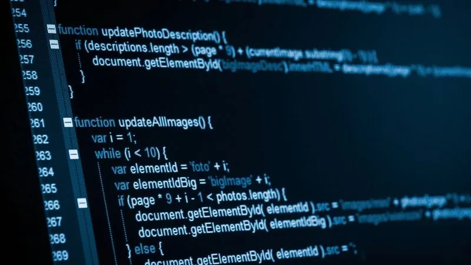

# Proyecto colaborativo JARG/WSSH
---

Nombre de programadores encargados del proyecto:
---
- Ing. José Antonio Ramírez García
- Ing. Wendy Selene Sánchez Hernández

Secciones elaboradas:
---
- Index / Main
- Dashboard / Developer1
- Tables / Developer2

Lenguajes de programación usados:
---
- HTML 5: Lenguaje que sirve para definir la estructura, el diseño y el contenido de la página web.
- JavaScript: Lenguaje que sirve para hacer la páginas web interactiva, permitiendo que el contenido se actualice, responda al usuario y ejecute lógica tanto en el navegador como en el servidor, sin necesidad de recargar la página.

Estructura de la plantilla:
---
- CSS: Hojas de estilo para las páginas web
- Varios: Archivos para el diseño de readme

Autores:
---
@mastercoffee
@selenehdez007

